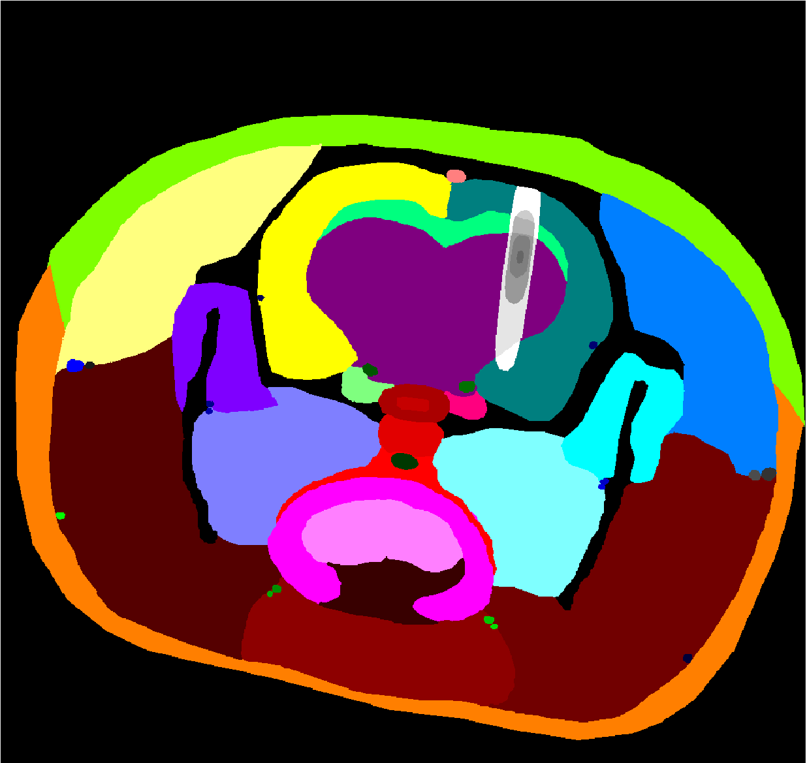

# What is PerfSim?
PerfSim is a software for the simulation of perfusometric DCE-MRI data. It creates **k-space data** of the dynamic sequence based on a set of input parameters and acquisition settings, and calibration scans necessary for T10 mapping.

## How does PerfSim work?
The input of the simulator is an indexed image, with perfusion parameters assigned to every index in an attached table. Also, complex coil sensitivities in Matlab format are used as an input. 

For every set of input perfusion parameters (assigned to some ROI in the indexed image), the impulse response function (IRF) with high temporal sampling is generated based on a selected pharmacokintetic model. Arterial input function (AIF) is generated globally using given mathematical model, and concentration curves are calculated as the convolution of IRF and AIF. The set of curves is converted to signal intensity with a given acquisition model - here, we are using FLASH.

At this point, an image sequence is created from the input indexed phantom and the signal curves assigned to individual ROIs. The sequence is scaled by coil sensitivites, subsampled in space and time, and transformed to the k-space according to the chosen coordinates.

<p align="center">

</p>


## Our input data
### Phantoms
We have developed two phantoms for the simulations, both depicting an axial slice of a rat's head. The tissues were segmented from a real DCE dataset and perfusion parameters were assigned based on literature or perfusion analysis. 

The first phantom contains a glioblastoma in brain, the second phantom contains a region with blood-brain barrier opened by focused ultrasound. You can find the input data for these studies in folders `data/input_GBM` and `data/input_FUS`, respectively.

 


### Coil sensitivities
We estimated sensitivities of three coils: 1-channel surface coil, 4-channel surface coil and 1-channel ring coil for FUS experiments. The geometry is compatible with the rat head phantom. For the 4-channel coil, we have sensitivities derived from real data and sensitivities derived from a phantom measurement (top row here).

 

<br />
 


<!---

 

--->

## How to run PerfSim?
The simulator is run from the `main.m` script. The example settings are held for the FUS experiment and don't require any other modifications. 

### Changing the input data
Switching to glioblastoma (GBM) experiment requires changing of the input data paths, specifically:

```
config.workDir.input = '../data/input_GBM' 
config.phantom.structure = 'phantomGBM.png' 
config.phantom.roiParam = 'ROI_paramGBM.csv'  
```
and 1-channel or 4-channel coil:
```
config.acquisition.sensitivities = 'sensitivitiesSUC.mat'
config.acquisition.sensitivities = 'sensitivitiesARR.mat'
```
 
Usually, you also want to change the output data folder in `config.workDir.output`.

### Main settings
Considering the main settings, you can switch on/off the simulation of `precontrast` / `dynamic` scans in these variables, or change the type of calibration scans in the `model` variable. Three types of calibrations were implemented - `vFA`, `vTR` and `IRLL`.

Apart from that, k-space sampling can be selected in the `config.acquisition.kSampling.method` parameter - `cartesian`, `radial` and `rosettes` options were implemented. For the Cartesian and radial sampling, a simple reconstruction algorithm was also designed (can be turned on in the `reco` parameter). The reconstruction outputs a single file, suitable for subsequent perfusion analysis in our [PerfLab](http://perflab.cerit-sc.cz/) software. 

For more detailed description, see the [Simulation settings](documentation/configuration.md).


## What is the output of PerfSim?
You can find your simulated data in a folder defined in the `config.workDir.output` parameter. Two folders are inside - `Data1` containing calibration scans and `Data2` containing the dynamic sequence.

Both have 5 main output files:

<p align="center">

| File name | Content |
|----------|-----------|
| `AIF.mat`       | time course of the AIF |
| `config.json`      | simulation parameters |
| `kTrajectory.mat`    | k-space coordinates |
| `SyntheticEchoes.mat`      | echo signals |
| `tissue.mat`      | extended parametric table |

</p>

The key file is, of course, the `SyntheticEchoes.mat`. The echo signals have 4 dimensions, defining the number of: 
- echo samples,
- phase encoding steps x repetitions, or projections, or rosettes (based on the k-space sampling type),
- echo times,
- coil channels. 

For subsequent data analysis, the `tissue.mat` table might be also important. Apart from the input parameters, it contains all the modeled signals assigned to single ROIs - TRF, c<sub>t</sub>, R<sub>1</sub>, R<sub>2</sub>, SI<sub>TE0</sub> and SI, and also the binary segment of the phantom.

In the case of calibration scans, there will be multiple echo and tissue files present when using the multi-FA or multi-TR method, each for one of the varying parameter set.

## How to setup PerfSim for other applications?
See the documentation of all possible settings and parameters, specifically:

- [Format of the input data](documentation/input_data.md)
- [Simulation settings](documentation/configuration.md)
- [Generation of the ground truth data](documentation/ground_truth.md)

## Acknowledgements
<a href = "http://www.isibrno.cz/en">

</a>
<a href = "https://www.czech-bioimaging.cz/">

</a>